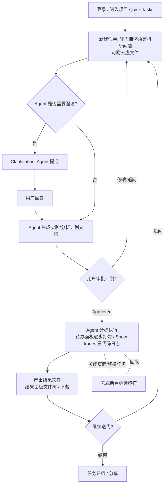
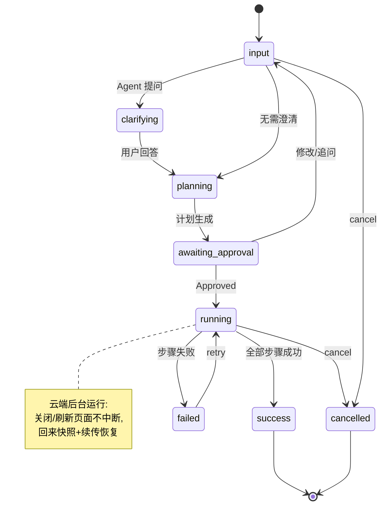

# Biomni 产品分析与改进版原型规划（analysis.md）

> 目标产品：Biomni / Biomni Lab（https://biomni.phylo.bio/）
> 本文回答：目标用户与核心任务、页面/功能/用户路径、任务状态机、核心交互与可简化项、功能取舍、技术推断与不确定点、降级方案，并给出改进版原型范围（**采用方案一：工作流/任务画布**）。
> 分析范围：本文重点分析登录后的 Biomni Lab 工作台。官网营销首页、登录鉴权流程，以及部分需要账号权限或真实后端资源的页面无法完整验证，因此不将它们写成已确认的现状结论。
> 证据规则：文中“观察到”表示来自页面、DOM 或公开资料的直接证据；“推断”表示基于界面行为、命名和产品资料做出的合理判断；无法验证的内容单独列入“不确定点”。

---

## 0. 一句话定位

Biomni 是一个**通用生物医学 AI Agent / 集成生物学环境（IBE）**：科学家用自然语言下达科研任务，Agent 自主**规划 → 澄清 → 获批 → 分步执行（调用工具/写代码）→ 产出结果文件**，全程在云端后台运行、可追踪、可中断恢复。它把"碎片化的科研工具链"收敛为"一个对话式 + 可追踪的科研工作空间"。

---

## 1. 目标用户与核心任务

| 维度 | 结论 |
|---|---|
| 目标用户 | 生物医学研究者、生物信息分析师、药企/生物技术公司研发人员；次要：需要快速做文献/数据综述的 PI 与学生 |
| 核心任务 | 用一句话下达一个**多步骤科研任务**（如"设计某蛋白理性设计实验并产出报告""分析单细胞/转录组数据""靶点评估"），由 Agent 端到端执行并交付**可下载的结果文件 + 可追溯的执行过程** |
| 用户价值 | 把"数周的人工分析流程"压缩到"分钟级"；把"频繁切换工具/数据集"收敛为"一个工作空间"；保证**严谨、可控、可追踪**（科学家要能审计 Agent 每一步） |
| 关键诉求 | ① 过程透明可审计（traces/待办/结果）② 可控（澄清、计划审批、取消）③ 后台长时运行（关页面不丢）④ 结果可复用（文件树/下载） |

---

## 2. 产品全景：页面、功能与用户路径

### 2.1 Biomni 当前工作台的信息架构 / 页面与面板

以下内容描述的是当前可观察到的登录后工作台，不包含本项目新增的改进功能。

- **图标栏（60px，最左侧独立列）**
  - `w-[60px] h-screen bg-sidebar border-r flex flex-col items-center py-3`
  - 上部：Logo + 项目(FolderOpen, 激活态) + **中心 → `/skills` Skill Hub 技能中心**（Blocks 仅为 lucide 图标名，隐喻"技能 = 可插拔能力积木块"）。实测（2026-09-19）：页面标题 "SKILL HUB"，展示技能卡片列表（Biomni Lab 官方 81 项，如 large-scale-virtual-screening / omics-dataset-retrieval / protein-structure-prediction），每项含分类（DRUG/DATA DISCOVERY、MOLECULAR DESIGN…）、描述、启用开关（Enabled）；顶部支持来源筛选（All/Mine/Biomni Lab/Team/Community）+ `New skill` 新建。它把 §4 行 15 的"150 工具/105 包/59 库"封装成面向用户的可开关技能单包，是 Agent 能力池的管理入口
  - 底部 `mt-auto`：帮助(CircleHelp) + 账号头像(用户名)
  - 每项：`flex flex-col items-center gap-1 py-2 w-full transition-colors group`
- **项目侧栏（320px，可折叠 + 可拖拽调宽）**
  - 外层：`overflow-hidden relative transition-all duration-300 ease-in-out`
  - 右边缘拖拽条：`w-1 cursor-col-resize hover:bg-primary/20 active:bg-primary/30 hidden md:block`
  - 右上角折叠按钮：`panel-left` 图标，32×32，title="折叠面板"
  - **项目切换器**：`<button role="combobox" aria-haspopup="dialog">`，上行 "PROJECT"（`text-[10px] uppercase tracking-wider`），下行项目名（`text-xl font-display`）
  - **任务 section**（height:50%）：
    - Header：`bg-muted/50 min-h-[40px] border-b-2 border-b-primary`（★ 签名样式：2px primary 粗底线）
    - Header 左：[▾ Collapse] + "任务"；Header 右：[搜索] + [查看全部]
    - 分组："等待输入"（`data-testid="project-sidebar-awaiting-section"`，带计数 badge）+ 其它任务
    - 任务项：`border-l-2`（激活=border-primary + bg-primary/30，普通=transparent）+ 状态圆点(lucide circle 2.5×2.5) + 标题 + time-ago + `transition-colors duration-500`
    - `data-testid="project-sidebar-task"` + `data-session-id` + `data-active`
  - **云盘 section**（height:50%）：
    - Header 同任务区样式（无 border-t）
    - 空态：`px-3 py-4 text-center text-sm text-muted-foreground` → "No files yet"
- **中栏（会话流，核心交互区）**
  - **顶栏（56px）**：面包屑 `Quick Tasks / 任务名` + 分享 + Transfer(aria="Hand off chat access") + 布局(Radix DropdownMenu, `aria-haspopup="menu"`) + 运行计时(`data-testid="task-runtime-readout"`)
  - 用户输入 bubble（`data-testid="user-message"`）。
  - Agent 过程块：`Show traces`（折叠的代码/日志）、**Clarification 卡片**（结构化多问表单：4 问 × 选项组 × Other × 单个 Submit）、**计划文档卡片**（带 `Approved` 状态）。
  - Agent 消息操作条：`data-testid="prompt-actions"`（重试 `prompt-retry` + Copy + 赞 + 踩）
  - **从此处新建/分叉（fork）**：`data-testid="fork-from-here"`（★ 从任意一条 Agent 消息分支出新会话，把"一次任务的结论"变成"下一次任务的起点"，构成科研迭代闭环）
  - **后续问题建议**：`data-testid="follow-up-question"` + `follow-up-question-label` + `fork-follow-up`（★ Agent 主动推荐下一步问题，每条可一键"在新任务中提问"或 Dismiss）
  - **审查**：消息下方 `审查` 按钮（对产出/过程的审阅入口，推测关联 Agent 质量反馈）
  - 流式文本：`data-testid="streaming-text-root"`（★ 确认 SSE 打字机渲染）
  - **底部 Composer**：
    - `data-testid="composer-stack-region"`（附件/引用预览堆叠区）
    - `contenteditable` 富文本输入（非 textarea）
    - `unified-add-trigger`（统一添加入口）+ `unified-add-file-input` + `unified-add-folder-input`（★ 支持整文件夹上传）
    - `自动` Switch（`peer inline-flex rounded-full border-2`）
    - `model-profile-selector`（当前档位 `Standard`，非固定 `Max`）
    - `task-composer-send`（Send 按钮）
  - 提示条（`data-testid="rotating-tip"`）：轮换使用提示
- **右栏（追踪/产物，4 个可折叠卡 + 可拖拽调宽）**
  - chat ↔ 右栏之间有 **8px 拖拽分隔条**（`w-2 cursor-col-resize hover:bg-primary/50`）
  - 每卡有独立 `关闭` 按钮（可单独关闭，不是四选一）
  - 待办（Todo/Steps）：步骤清单，逐步打勾；空态 "暂无待办列表 / 多步骤任务会显示待办项"
  - 结果（Results）：文件树 + `Refresh results from storage` 按钮（★ 结果从对象存储按需拉取）；空态 "暂无结果 / 文件将显示在此处"
  - 计算（Compute）：机器 / 后台 / 作业。
  - 笔记（Notes）。

### 2.2 核心用户流程

---

## 3. 一次任务从输入到结果的状态机

### 3.1 任务级状态

| 状态 | 含义 | 触发 | UI 反馈 |
|---|---|---|---|
| `draft/input` | 用户编辑输入 | 新建任务 | 输入框可编辑 |
| `clarifying` (waiting) | Agent 提问等待用户澄清 | Agent 发起澄清 | 澄清卡片 + 输入框 |
| `planning` | Agent 生成计划文档 | 澄清完成/直接规划 | 计划卡片 loading |
| `awaiting_approval` | 计划待用户审批 | 计划生成完毕 | 计划卡片 + Approve 按钮 |
| `running` | 分步执行中 | Approve 后 | 待办逐步打勾、traces 流式、节点脉冲 |
| `success` | 全部步骤成功、结果产出 | 末步成功 | 结果文件树可下载 |
| `failed` | 某步失败 | 步骤异常 | 错误提示 + 重试按钮 |
| `cancelled` | 用户取消 | 取消操作 | 标记已取消、停止流 |

### 3.2 步骤级状态（待办/画布节点共用）

`pending → running → success | failed`；`failed --retry--> running`；任务取消时运行中步骤 → `cancelled`。

### 3.3 状态图

> **刷新恢复是产品级特性**（"close the page, it'll keep working"）：任意时刻 reload，前端先拉**快照**（任务+步骤+结果）渲染，若仍 `running` 则重新订阅流并**续传**后续事件，而非重跑。

---

## 4. 基于现状的改进版功能取舍

本节开始从“分析 Biomni”切换到“本项目准备如何改进”。“有”表示 Biomni 当前已有该能力；“无”表示当前观察中未发现，或不属于 Biomni 的现有交互。

优先级定义：**P0 = 核心闭环必须**；**P1 = 创新/差异化（本次重点）**；**P2 = 延后/降级**。

| # | 功能 | 现状 | 取舍 | 优先级 | 理由 |
|---|---|---|---|---|---|
| 1 | 自然语言任务输入 + 会话流 | 有 | **保留** | P0 | 产品入口与核心交互 |
| 2 | Agent 分步执行 + 待办面板 | 有 | **保留** | P0 | 过程透明的核心载体 |
| 3 | 流式 traces（代码/日志折叠） | 有 | **保留(简化)** | P0 | 可审计性；原型只展示摘要+折叠 |
| 4 | 结果文件树 + 下载 | 有 | **保留** | P0 | 任务交付物，闭环终点 |
| 5 | 加载/失败/重试/取消/刷新恢复 | 有 | **保留(强化)** | P0 | 作业硬指标，状态完整性 |
| 6 | 计划文档 + Approve 审批 | 有 | **保留** | P1 | "可控"的关键交互，衔接画布编辑 |
| 7 | 澄清（Clarification）问答 | 有 | **保留(简化)** | P1 | 体现 waiting 状态；原型做单轮 |
| 8 | **任务画布（DAG 编排+实时状态）** | 无 | **新增(方案一)** | P1 | 把线性待办升维为可编辑/可追踪工作流，见 §8 |
| 9 | 云盘（上传/管理输入文件） | 有 | **降级** | P2 | 原型用本地文件模拟，不做完整云盘 |
| 10 | 计算面板（机器/后台/作业） | 有 | **删除/降级** | P2 | 依赖真实云沙箱；原型用任务级状态代替 |
| 11 | 笔记 | 有 | **删除** | P2 | 与核心 loop 无关 |
| 12 | 分享/协作 | 有 | **删除** | P2 | 需多用户/权限，超范围 |
| 13 | 多模型选择（Max 等） | 有 | **降级** | P2 | 原型固定 Mock/单一 provider，留接口 |
| 14 | 任务搜索/网格视图 | 有 | **删除** | P2 | 列表足够 |
| 15 | 150 工具/105 包/59 数据库真实调用 | 有 | **按本地 Skill 能力逐步接入** | P0* | 不伪造远程工具市场；本地 Skill 提供可审计的领域指令，真实 Agent 负责执行 |
| 16 | 从此处新建/分叉（`fork-from-here`） | 有（实测新增） | **新增(候选)** | P2 | 科研迭代闭环；原型可在任务级预留 fork 入口，非核心 loop 暂缓 |
| 17 | 后续问题建议（`follow-up-question`/`fork-follow-up`） | 有（实测新增） | **降级** | P2 | Agent 推荐下一步问题；依赖真实 Agent 能力，原型 Mock 下省略 |
| 18 | 消息反馈 赞/踩 + 审查 | 有（实测新增） | **删除** | P2 | 面向 Agent 质量评测，超出前端原型范围 |
| 19 | 技能中心 Skill Hub（`/skills`，本地技能注册表+开关） | 中心入口此前无响应 | **升级为真实本地能力管理** | P1 | 从项目 `skills/` 目录读取 `skill.md`，通过 Skill Hub 展示、搜索、查看详情和持久化启用状态；启用的 Skill 会进入后续 Agent 任务上下文。暂不接入远程 Biomni 技能市场 |

> 取舍总原则：**保核心 loop 与状态完整（P0）→ 做画布差异化（P1）→ 其余一律降级/删除（P2）**，契合"不以页面数量/代码量为评价标准"。

---

## 5. 核心交互 vs 可简化/延后

- **核心（不可砍）**：任务输入 → 流式步骤执行 → 结果产出；以及**加载/失败/重试/取消/刷新恢复**五态；待办/结果两面板。
- **可简化**：traces 只给摘要+折叠；澄清做单轮；计划审批做单按钮 Approve；模型选择固定。
- **可延后/删除**：云盘、计算面板、笔记、分享、搜索/网格、多模型、多用户。

---

## 6. 技术实现观察、推断与不确定点

### 6.1 DOM 观察结果与高概率推断

- **前端框架：高概率为 Next.js App Router**（证据：Next Font 变量类、`<meta name="next-size-adjust">`，且未发现旧式 `__NEXT_DATA__`；仅凭 DOM 不能绝对证明构建方式）
- **样式方案：高概率为 Tailwind CSS，并使用 Typography 类**（证据：大量 utility class、`prose prose-base max-w-full`；无法仅凭页面排除其他编译方案）
- **组件库：疑似 shadcn/ui + Radix**（证据：`data-state`、`aria-haspopup="menu"`、`ring-offset-background`、Switch 常见 class 组合）
- **图标：疑似 lucide-react**（证据：多数 SVG 带 `lucide lucide-*` 类）
- **监控：页面接入了 Sentry production**（证据：`sentry-trace`、`sentry-environment=production`、`sentry-release` 元数据）
- **流式更新：界面表现为打字机/增量渲染；底层传输协议未完全确认**（`data-testid="streaming-text-root"` 只能证明渲染容器，不能单独证明一定使用 SSE）
- **布局**：四区 flex shell（60px 图标栏 + 320px 侧栏 + 聊天 + 8px 拖拽 + 368px 右栏），页面级不滚（app-shell），所有滚动在内部容器
- **侧栏/右栏均可拖拽调宽**（`cursor-col-resize`）
- **i18n**：有字典（`<html lang="zh">`，但 "Quick Tasks"/"Show traces"/"Transfer"/"Submit" 保留英文）
- **主题**：`theme-classic light` + `color-scheme: light`
- **E2E 测试**：有大量语义化 `data-testid`（project-sidebar-task / streaming-text-root / task-composer-send 等）
- **模型选择**：叫 `model-profile-selector`（档位组合，非单纯模型名），当前会话为 `Standard`
- **文件上传**：支持整文件夹（`unified-add-folder-input`），不只是单文件
- **结果面板**：有 `Refresh results from storage` 按钮 → 结果从对象存储按需拉取
- **协作**：有 `Transfer`（Hand off chat access）会话移交功能
- **Biomni 没有 React Flow 画布**（`hasReactFlow: false`，无任何 `rf__*` testid）→ 本项目的任务画布是**真正的差异化创新**
- **后端**：任务编排服务 + Agent runtime（Biomni-A1）：规划 → 工具选择 → 代码生成 → 执行 → 依据结果动态调整后续步骤。
- **执行环境**：**云端沙箱/虚拟机**跑生物信息代码（"runs on cloud machines"），故任务可后台长时运行、与前端会话解耦。

### 6.2 仍不确定点（原型不依赖）

- 事件重连/续传机制细节（Last-Event-ID？还是快照+重放？本项目用后者）。
- 计划 `Approved` 是否为硬阻塞门，还是可跳过/自动模式（界面有`自动`开关，推测自动模式跳过审批）。
- 云端沙箱的隔离与生命周期管理；多 Agent/多机调度细节。
- 澄清是否支持多轮（实测为单轮结构化表单：4 问 × 选项组 × Other × Submit）。
- 后端语言与编排引擎。
- `布局` dropdown 菜单的具体选项（未展开验证）。

### 6.3 可选的边界状态

除主流程中的输入、澄清、规划、审批、执行、成功、失败和取消外，真实产品还可能出现以下状态。本项目原型按时间优先级只实现前者，后者通过统一的状态提示降级：

- `queued`：任务已提交但尚未获得计算资源；
- `partial_success`：部分步骤成功，部分步骤失败，允许从失败步骤重试；
- `recovering`：刷新或断线后正在恢复任务快照与事件订阅；
- `download_failed`：结果已生成但文件下载失败，可重新拉取或复制结果链接。

---

## 7. 降级方案（登录/后端/外部服务不可复现时）

| 不可复现项 | 原因 | 降级策略 | 真实替换点 |
|---|---|---|---|
| 多用户登录/鉴权 | 需账号 | 原型单用户、本地运行，不做鉴权 | 接入 OAuth/Session 的中间件位 |
| 150 工具/105 包/59 数据库真实调用 | 外部生物资源 | **本地 Skill 注册表 + 真实 Agent 指令加载**：技能定义以 `skills/<id>/skill.md` 版本化，Agent 按启用状态加载 | 后续可为具体 Skill 增加真实工具适配器或远程数据源 |
| 云端沙箱执行代码 | 需云资源 | 本地进程/纯 Mock 步骤模拟执行与耗时，不真跑生物信息代码 | runner 内 `executeStep()` 替换为沙箱调用 |
| 云盘/文件存储 | 需对象存储 | 本地文件系统 + SQLite 元数据模拟文件树与下载 | 换 S3/对象存储 adapter |
| 计算面板（机器/作业） | 需真实集群 | 删除，用任务级状态代替 | 预留 compute 资源模型 |
| 分享/协作/笔记 | 需多用户 | 删除 | 预留路由与权限位 |

> Mock 范围与真实接口替换点将在 README 中明确标注（作业要求）。

最小可用降级路径是：用户输入任务 → 本地状态机模拟执行 → 展示步骤进度 → 产出本地结果文件 → 支持失败重试、取消和刷新恢复。这样即使没有登录、真实 Agent、云沙箱或对象存储，也不会破坏核心任务闭环。

---

## 8. 改进版原型范围：方案一（工作流/任务画布）

### 8.1 为什么选画布（而非粒子视觉）

- **✅ 已确认：Biomni 没有 React Flow 画布**（DOM 实测 `hasReactFlow: false`，无任何 `rf__*` testid）。因此任务画布是**真正的差异化创新**，不是对现有功能的复刻。
- Biomni 的痛点是**过程黑盒**：会话流 + 线性待办难以表达"步骤间依赖、并行分支、哪步卡住"。画布把 Agent 的 plan **升维为一张实时 DAG**，让"Agent 在干什么/为什么"一眼可见，直接服务"严谨、可控、可追踪"的产品定位——是**有价值的创新交互**，而非装饰。
- 画布天然承载作业要求的状态表达（等待/执行中/成功/失败）与交互（节点展示、拖拽、连线、缩放/平移），技术含量与可讲性高于纯视觉方案。
- 用 React Flow 可在 2 天内覆盖拖拽/连线/缩放/平移，风险可控。

### 8.2 画布如何映射 Agent 状态

- **节点 = 步骤**（待办的一条），**边 = 依赖/先后**。
- 节点状态色：`pending` 灰 / `running` 蓝脉冲 / `success` 绿 / `failed` 红 / `waiting(澄清)` 黄 / `cancelled` 灰划除。
- **审批前可编辑**：在画布上增删节点、改连线（调整计划），Approve 后转**只读 + 实时状态推送**。
- 点击节点 → 侧抽屉展示该步 traces/输出/产物，与会话流、结果面板联动。

### 8.3 组件 / 状态管理 / 性能考虑（纲要，详见设计文档）

- **组件**：`CanvasView`(React Flow 容器) / `StepNode`(memo 自定义节点) / `EdgeLegend` / `NodeDrawer`(步骤详情) / 与右栏面板共享 store。
- **状态管理**：Zustand 单一 store，按节点 id 局部更新；SSE 事件 → store action；画布布局与任务状态分离（布局是视图态，任务是数据态）。
- **性能**：节点 `memo` + 视口裁剪；SSE tick 节流/RAF 批量合并再写 store；避免整图 re-render；大图降级为只读静态布局。

---

## 9. 下一步规划与已知限制

- **下一步**：① 打通 P0 闭环（SSE + SQLite + 状态机 + 五态）② 画布 P1 ③ 测试/Lint/TS strict + README + AI 使用记录 ④ 演示视频。
- **已知限制**：Mock 工具集非真实生物计算；单用户无鉴权；无云沙箱；画布暂不支持运行时动态改图（仅审批前编辑）；澄清单轮。

---

*本文为分析文档。§2.1 / §6 / §8.1 已于 2026-09-19 通过 AppleScript + Chrome DOM 实测（`sess_af4b00031712`）验证并修正；§2.1 中栏会话流、图标栏"中心"→`/skills` Skill Hub 与 §4 行 16–19（fork-from-here / follow-up-question / 赞踩反馈+审查 / 技能中心）已于同日第二个会话 `sess_57f6831fbe2d` 实测补充。其余章节基于公开资料与截图。登录态功能均按 §7 降级处理。*
*实测详细数据见 `sidebar-comparison.md`（左侧栏）及对话记录。*
